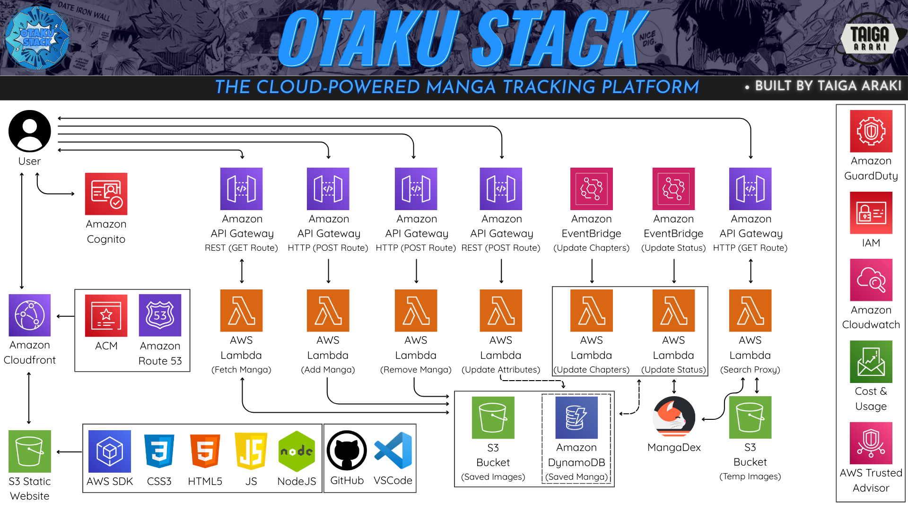

# Otaku-Stack

Welcome to the Otaku Stack — a fully serverless web app designed to let manga fans browse, search, and save manga from the MangaDex API

## Live Site
https://otakustack.net

## Stack
- **Frontend:** S3 Static Site + CloudFront + Route53
- **Auth:** Cognito
- **Backend:** Lambda + API Gateway + DynamoDB
- **Infrastructure:** AWS Everything™

## Features
- Authenticated user login and data retention
- Save your favorite manga to a custom collection
- Automatic background updates on manga status & chapter count
- Seamless MangaDex search via custom proxy
- Fully serverless infrastructure using AWS
