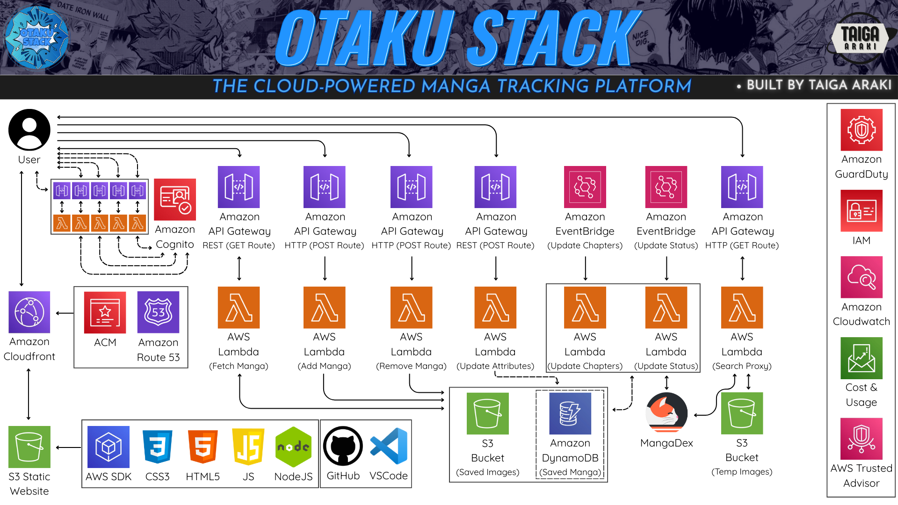
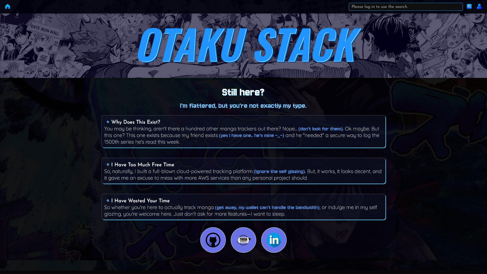
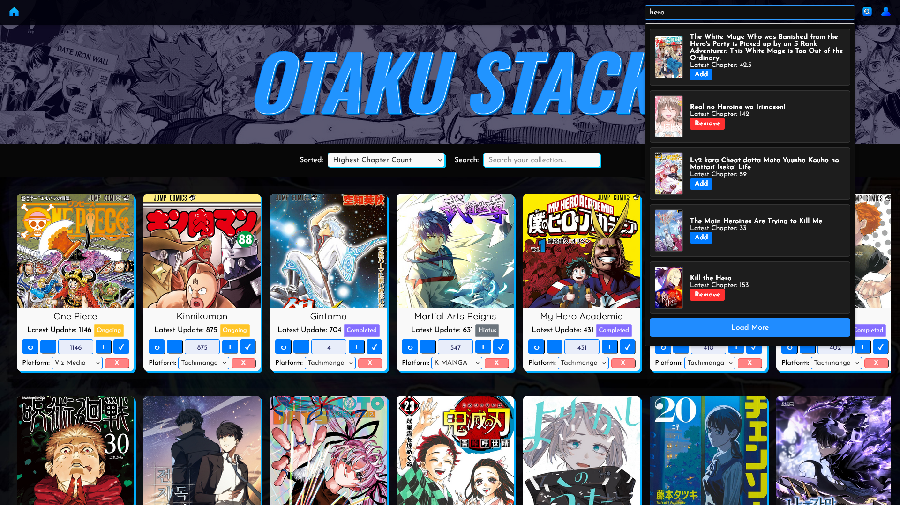

# Otaku-Stack

## Overview
Welcome to Otaku Stack! - https://otakustack.net — A fully serverless web app designed to let manga fans browse, search, and save manga from the MangaDex API.
You may be thinking, aren't there a hundred other manga trackers out there? Nope... (don't look for them). Ok maybe. But this one? 
This one exists because my friend exists (yes I have one.. he's mine -_-) and he "needed" a secure way to log the 1500th series he's read this week. 
So, naturally, I built a full-blown cloud-powered tracking platform (Ignore the self glazing).

## Architecture

## Features
- **Authenticated User Login & Persistent Data:** Secure sign-in through AWS Cognito ensures your collection stays yours. 
- **Personal Manga Collection Management:** Save titles you love, organize them in your own collection, and update attributes like your current chapter or where you're reading.
- **Automatic Background Updates:** Manga details like chapter count and status (ongoing, hiatus, etc.) are updated regularly using scheduled Lambda functions.
- **Streamlined MangaDex Search:** Instantly search MangaDex through a custom Lambda proxy that handles formatting and responses.
- **Fully Serverless Architecture:** Every component runs serverlessly using AWS services like Lambda, API Gateway, S3, and DynamoDB.
- **Cover Image Handling:** Manga covers are cached and stored intelligently between two S3 buckets — one for permanent saved covers and another for temporary search previews.
- **Custom Domain with CDN** Hosted on https://otakustack.net, delivered via CloudFront, with SSL via ACM and DNS powered by Route53.

## Screenshots
 

## Project Structure
<pre>otaku-stack/
├── frontend/
│   ├── index.html
│   ├── script.js
│   └── style.css
├── lambda/
│   ├── auth/
│   │   ├── authenticate.js
│   │   ├── get-aws-credentials.js
│   │   ├── refresh-tokens.js
│   │   ├── session-status.js
│   │   └── otaku-logout.js
│   ├── manga/
│   │   ├── add-card.js
│   │   ├── fetch-manga.js
│   │   ├── remove-card.js
│   │   └── update-attributes.js
│   ├── utils/
│   │   ├── search-proxy.mjs
│   │   ├── batch-chapter.mjs
│   │   └── batch-status.mjs
├── screenshots/
│   ├── OtakuStack-Collection.png
│   ├── OtakuStack-Diagram.png
│   └── OtakuStack-Homepage.png
├── LICENSE
└── README.md</pre>

## Implementation Details
1. ### Static Website Hosting

    Technology: S3, CloudFront, Route 53, ACM

    Details: The frontend is hosted on a static S3 bucket and served through a CloudFront distribution. HTTPS is enforced via an ACM certificate and custom domain https://otakustack.net managed by Route 53.

2. ### User Authentication & Authorization

    Technology: Amazon Cognito (User Pool + Identity Pool)

    Details:

        Handles user sign-up, sign-in, and session management.

        Used as an authorizer on secured API Gateway routes to verify user identity.

        Ensures that saved manga data is scoped per authenticated user.

3. ### Manga Collection Management

    Technology: API Gateway (REST & HTTP), Lambda, DynamoDB, S3

    Details:

        Add/Remove Manga: Via HTTP API gateway and AddMangaCardsDB/RemoveMangaCardsDB Lambdas. Saved manga metadata and image URLs are stored in DynamoDB and S3.

        Fetch Manga Cards: Through REST API Gateway + get-manga-cards Lambda to retrieve the user’s collection.

        Update Manga Info: Through REST API + update-read-chapter Lambda to change read chapter or platform.

4. ### MangaDex Search Integration

    Technology: Lambda, MangaDex API, API Gateway

    Details:

        A search proxy (MangaSearchProxy Lambda) handles queries to the MangaDex API through a GET route.

        Temporary image data is stored in the mangadex-images bucket.

5. ### Automated Manga Metadata Updates

    Technology: EventBridge (Scheduled), Lambda

    Details:

        Two scheduled Lambdas (BatchUpdateMangaStatus and BatchUpdateMangaChapters) use cron and regular intervals to update manga status and latest chapter info in user collections.

6. ### Visitor-Facing Image Storage

    Technology: S3

    Details:

        Static assets: Hosted in otaku-stack bucket.

        User manga covers: Persisted in otaku-stack-images.

        Temporary covers for search: Stored in mangadex-images.

7. ### Security and Monitoring

    Technology: IAM, CloudWatch, GuardDuty

    Details:

        Custom IAM roles and policies enforce least-privilege access.

        GuardDuty monitors for suspicious activity.

        CloudWatch logs Lambda execution and helps track performance/errors.

## License
This project is licensed under the [MIT License](./LICENSE).
